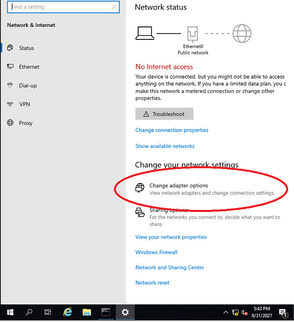
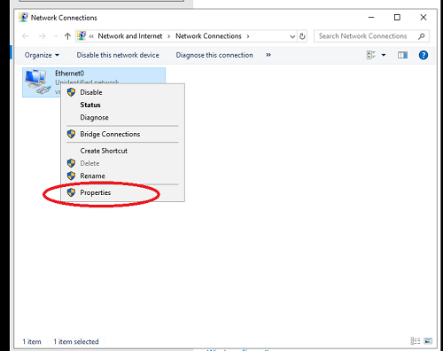
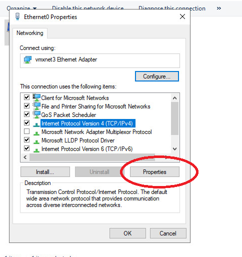
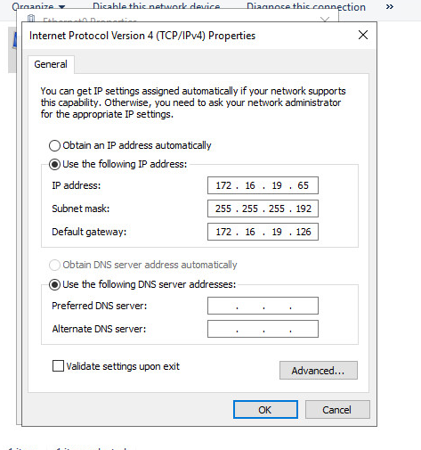
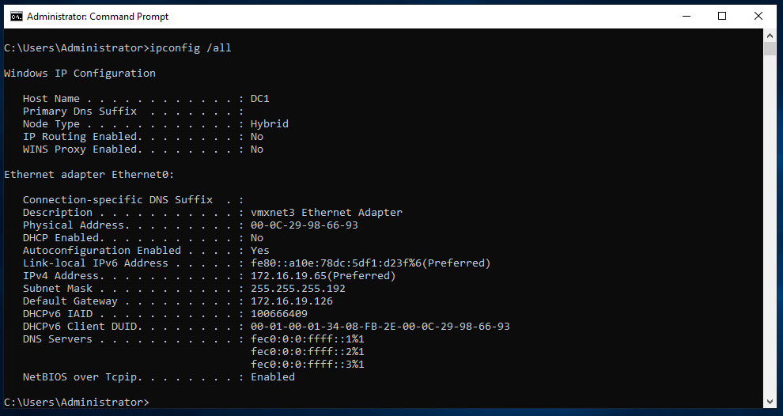
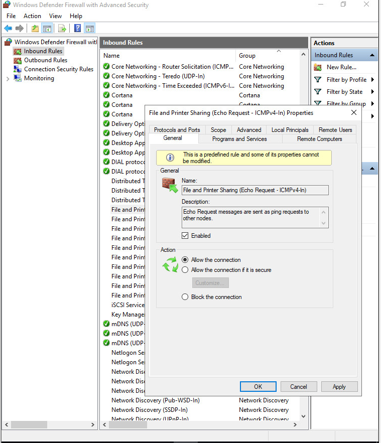

# Лабораторная работа. Базовая настройка сети Windows Serwer
## Ход выполнения работы  
### DC1
**1. Переименование имени компьютера**  
Для задания имени компьютера необходимо зайти в **Cвойства (Properties)**, далее перейти в **Изменение настроек (Change settings)** и кликнуть на **Изменить (Change...)**. Меняем имя компьютера на ***DC1***.     
Для применения изменений необходимо перезагрузить компьютер.  

  
  
 

**2. Настройка сетевых параметров**   
Для изменения сетевых настроек заходим в **Настройку параметров адаптера (Change adapter options)**, далее кликаем на **Свойства (Properties)**, снова на **Свойства (Properties)** и вручную вводим IP-адрес, Маску сети и Шлюз по умолчанию. По заданию IP адрес для DC1 это первый адрес из подсети *172.16.19.64/26*. Таковым является адрес *172.16.19.65*  
  
  
 
    

Для просмотра результата выполнения предыдущих заданий в командной строке выполним команду *ipconfig /all*    
  

**3. Обеспечение работы протокола ICMP**  
Для выполнения данного требования необходимо выполнить команду *fw.msc* и разрешаем правило *File and Printer Sharing (Echo Request — ICMPv4-In)*   

 
