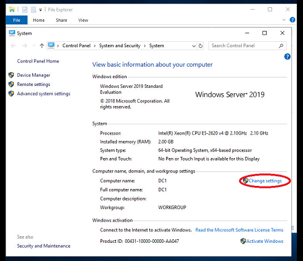
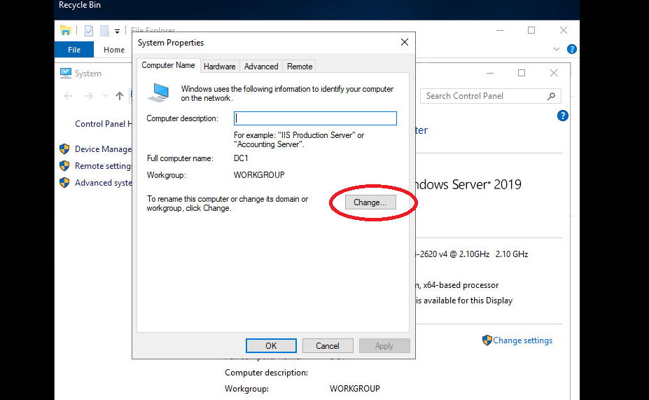
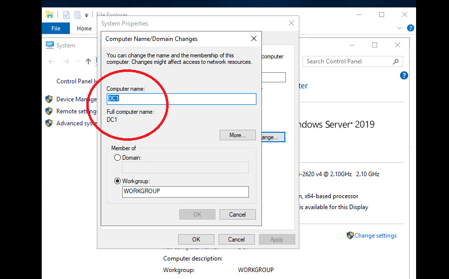

# Лабораторная работа. Базовая настройка сети Windows Serwer
## Ход выполнения работы
**1. Переименование имени компьютера**  
Для задания имени компьютера необходимо зайти в **Cвойства (Properties)**, далее перейти в **Изменение настроек (Change settings)** и кликнуть на **Изменить (Change...)**. Меняем имя компьютера на ***DC1***
  
  
 
