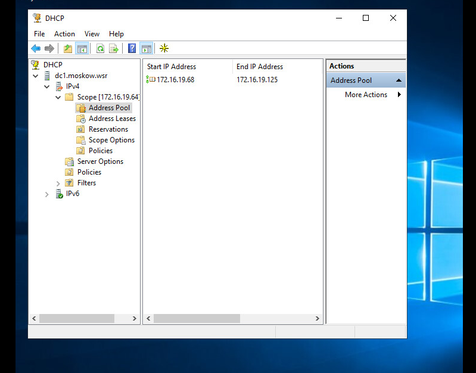

# Лабораторная работа №2
## Ход выполнения работы  
### Домен moskow.wsr
**Назначение роли контроллера домена moskow.wsr**    
(Подробное назначение ролей рассмотрим на примере DC2)  
На скриншоте снизу видно, DC1 является контроллером домена, а SRV1 дополнительным контроллером домена только для чтения.
    

**Настроим протокол DHCP**  
Т.к. первые три адреса из сети заняты серверами, то pool начнется с адреса 172.16.19.68 
Partner server назначим SRV1  

 
Настроим дополнительные свойства области (адреса DNS-серверов и основного шлюза)  

 
**Настроим протокол DNS** 
Настроим зоны прямого и обратного просмотров. Из скриншотов видно, что SRV1 является дополнительным DNS сервером в домене.  

 
 

**Создание элементов домена**   
  Создадим подразделения и соответствующие доменные группы IT и SALES, а также пользователей в ней  
  
      
     
   
    
 **Добовление остальных хостов в домен**  
 
     
     
    
  
 
  
  
  

