# Лабораторная работа №3
## Ход выполнения работы  
### 
**Обеспечение работоспособности протокола ICMP (для использования команды ping), при этом Windows Firewall должен быть включен для всех сетевых профилей.**   
  
1. Запускаем Group Policy Management
2. Создадим групповую политику **fw**
3. Далее переходим Computer Configuration -> Policies -> Windows Setting -> Security Settings -> Windows Defender  и включаем Firewall для всех сетевых профилей. 
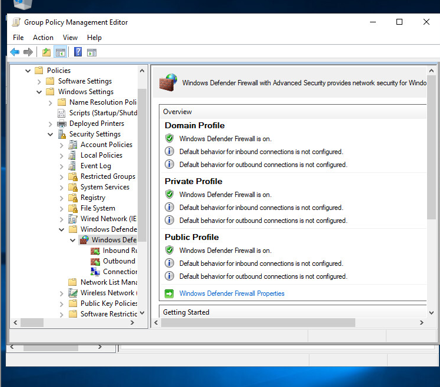  
4. Далее создаем новое правило  
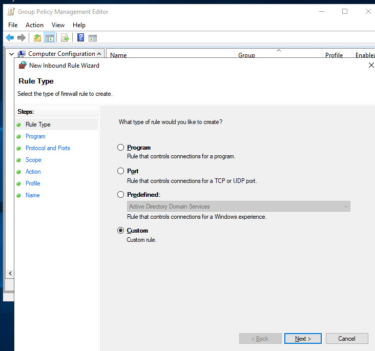 
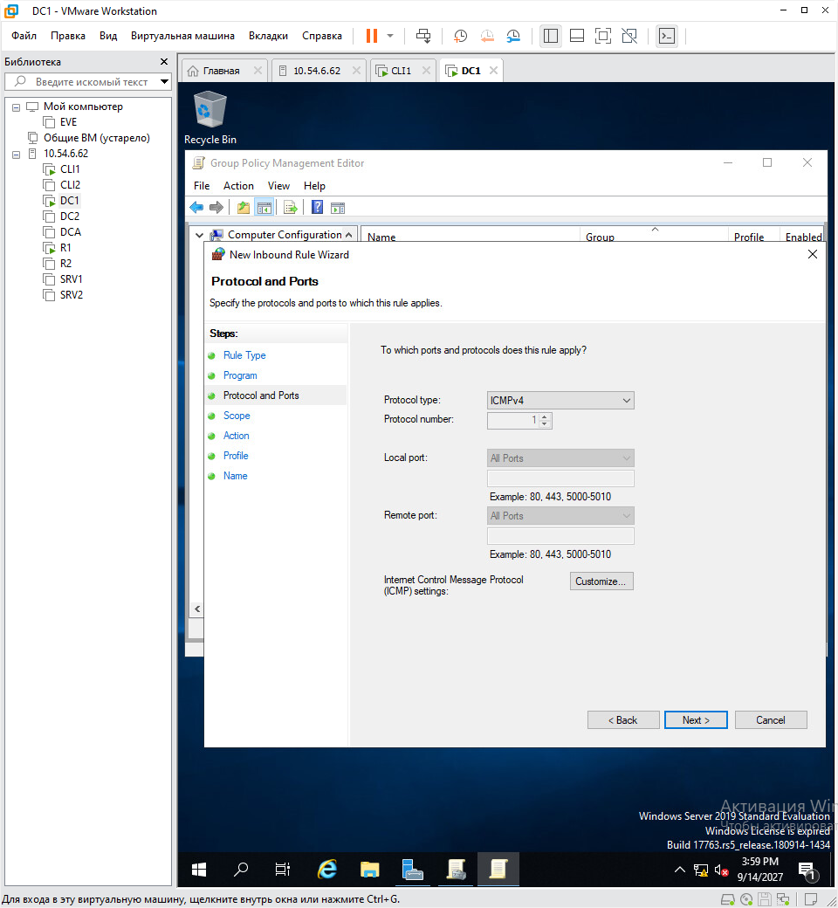 
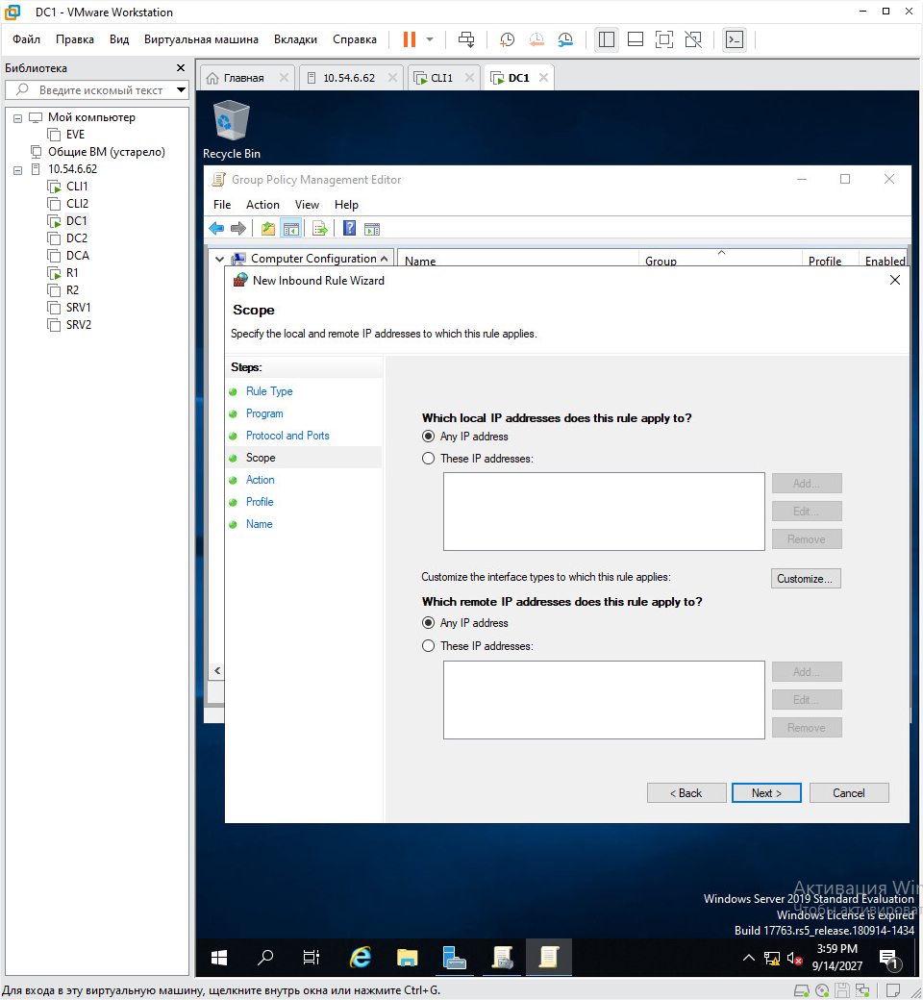
5. Разрешаем ICMP запросы
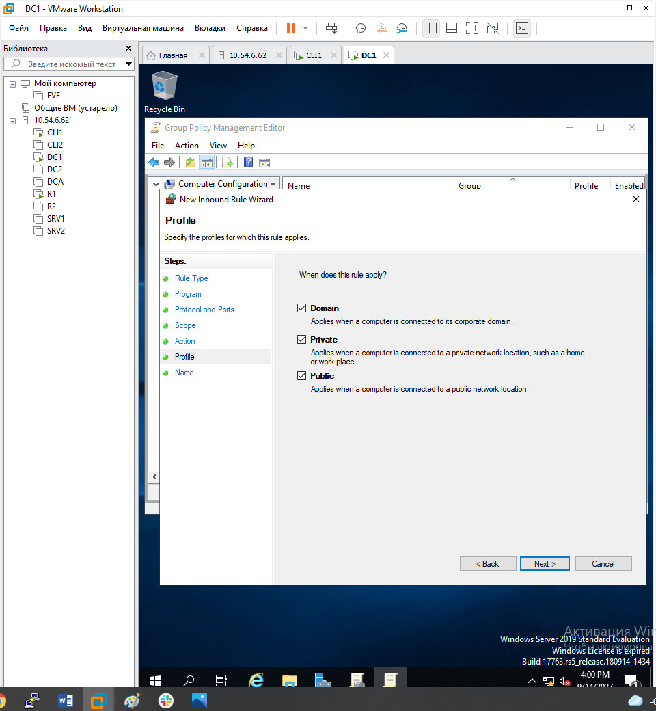   

Результат проверим на компьютере CLI. Видно, что он находится под политиками  
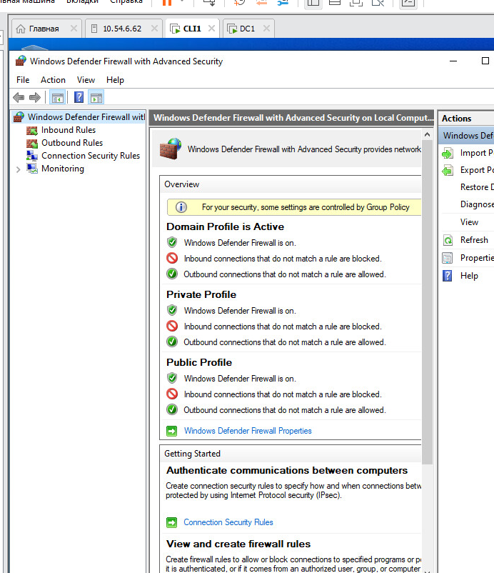   

**Далее запретим анимацию при первом входе пользователей в систему на всех клиентских компьютерах домена**    
Снова создадим групповую политику Computer Configuration -> Policies -> Administrative Templates -> System -> Logon
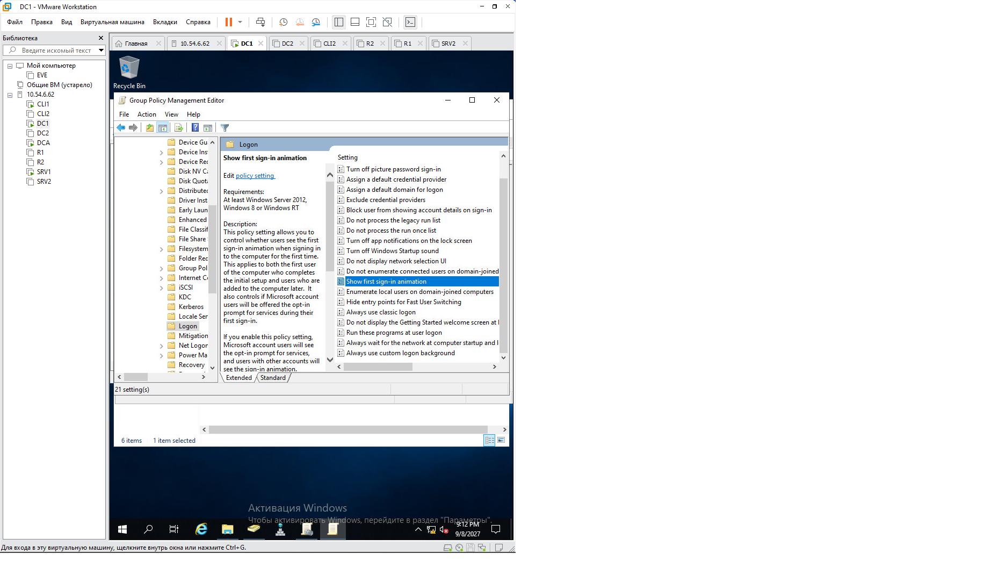  
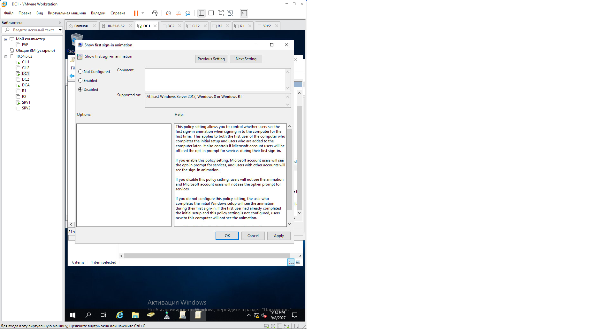 
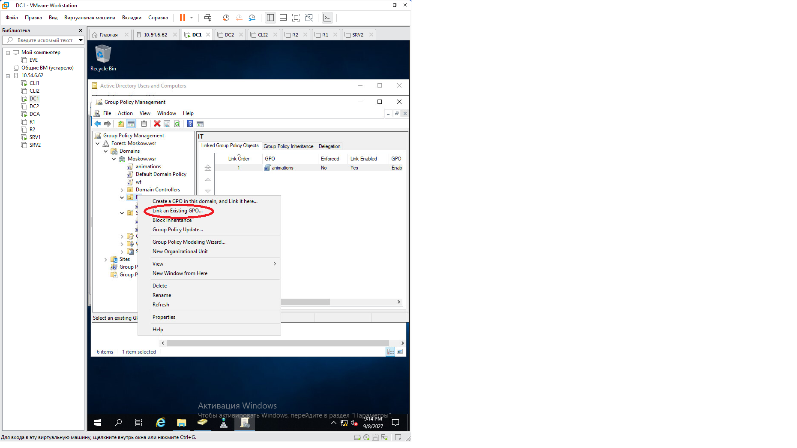    
  
**Добавим членов группы IT в группу локальных администраторов на все компьютеры в домене**    
переходим Computer Configuration -> Policies -> Windows Setting -> Security Settings -> Restricted Groups
  
Далее нажимаем *Add group* и добавляем *IT* в группу локальных администраторов.   
  
**Настройка домашней страницы в браузерах.**    
Для выполнения этого задания были установлены ADMX. 
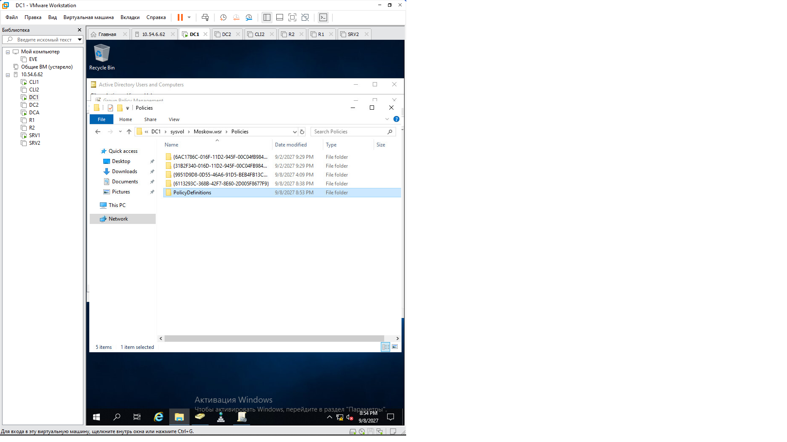
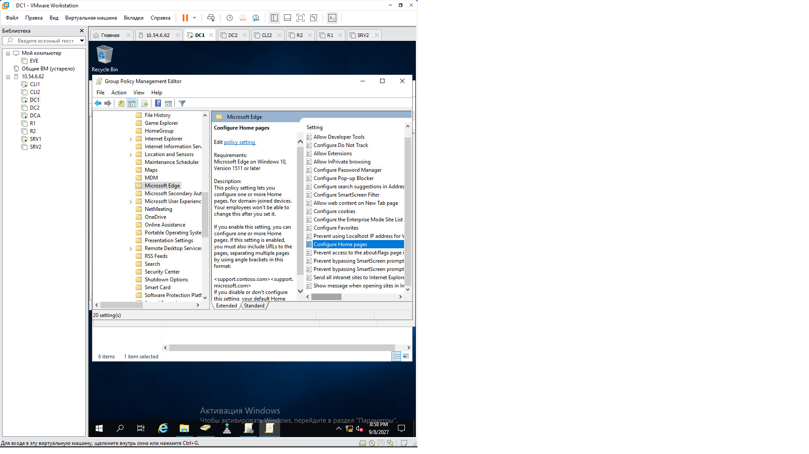
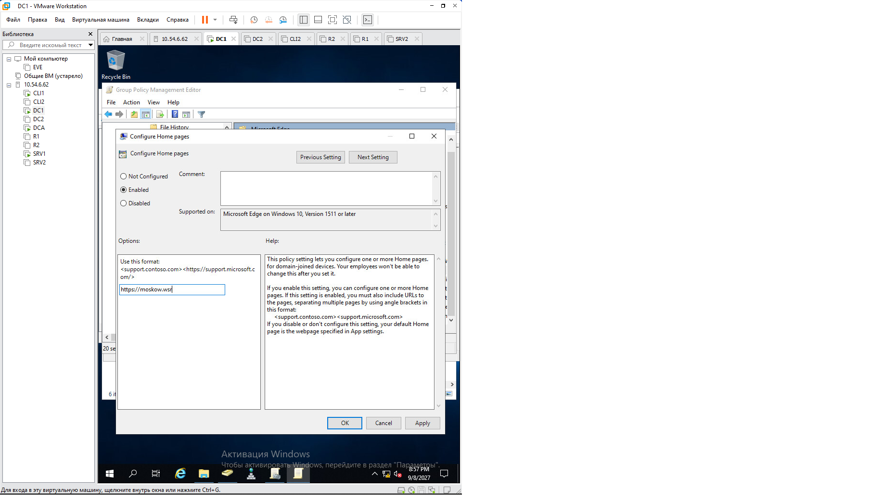
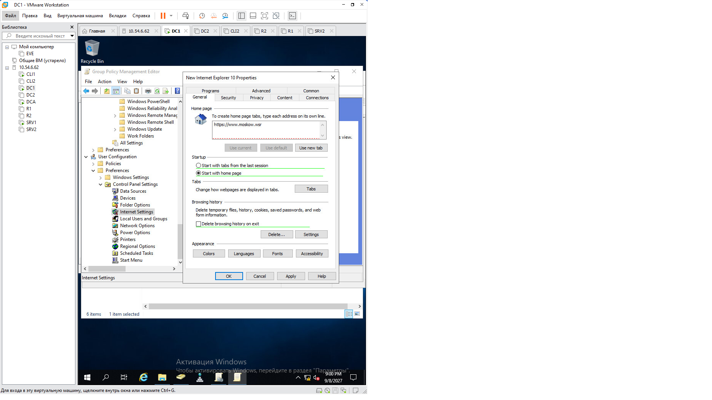    
  
  

