# Лабораторная работа №4
## Ход выполнения работы  
### 
**Создание с помощью скрипта 30 пользователей.**     
1. Запускаем Windows PowerShell ISE и создаем новый скрипт, который создаст 30 пользователей в контейнере IT: 
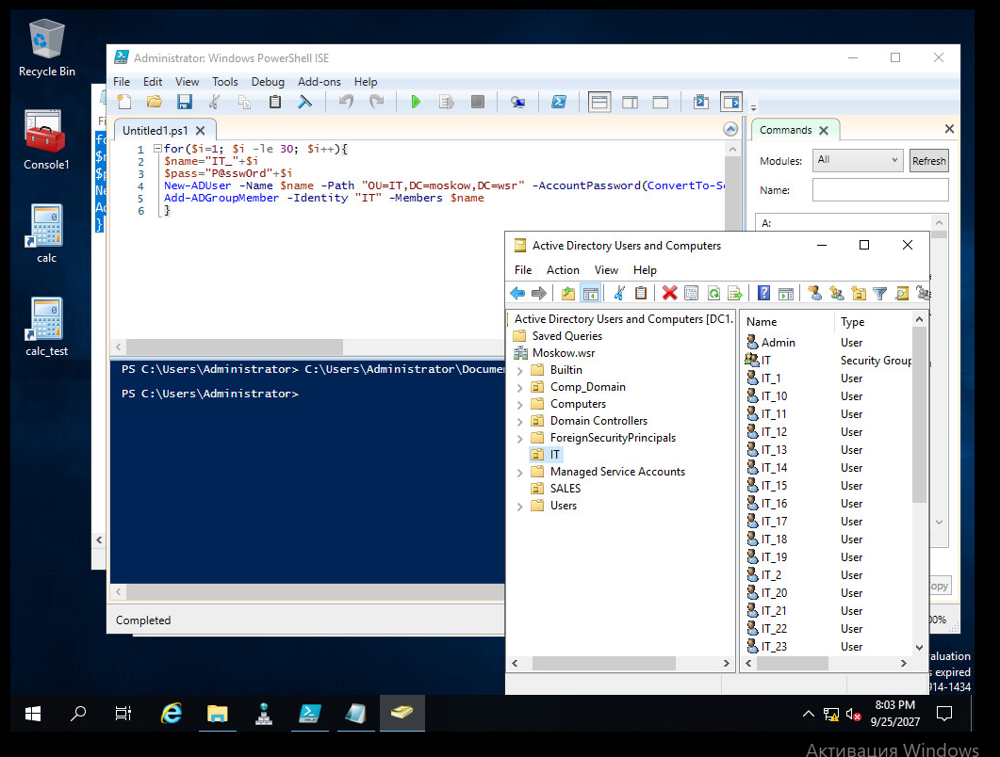 
2. Далее тоже самое проделаем с группой SALES:  
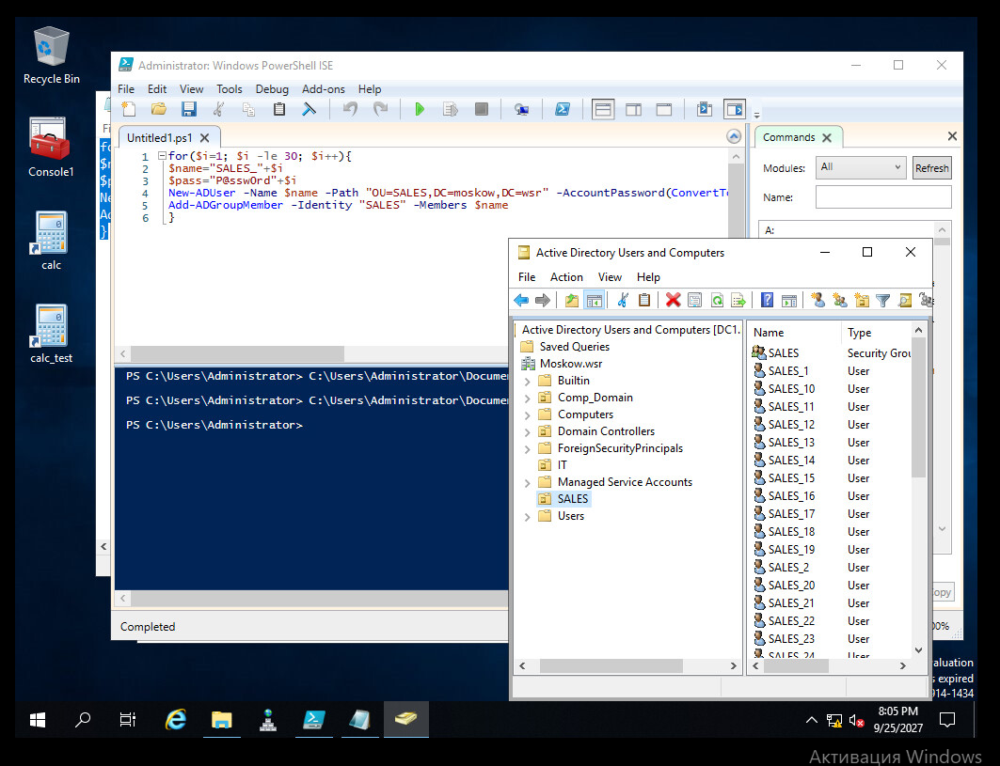 
  
3. Создадим RAID-5 массив с помощью дополнительных жестких дисков на SRV1 и назначим ему букву D:\
С помощью утидиты *diskpart* проверим количество дисков. Далее на каждом диске снимем ограничение на чтение и произведем динамическое преобразование. После чего создадим RAID.
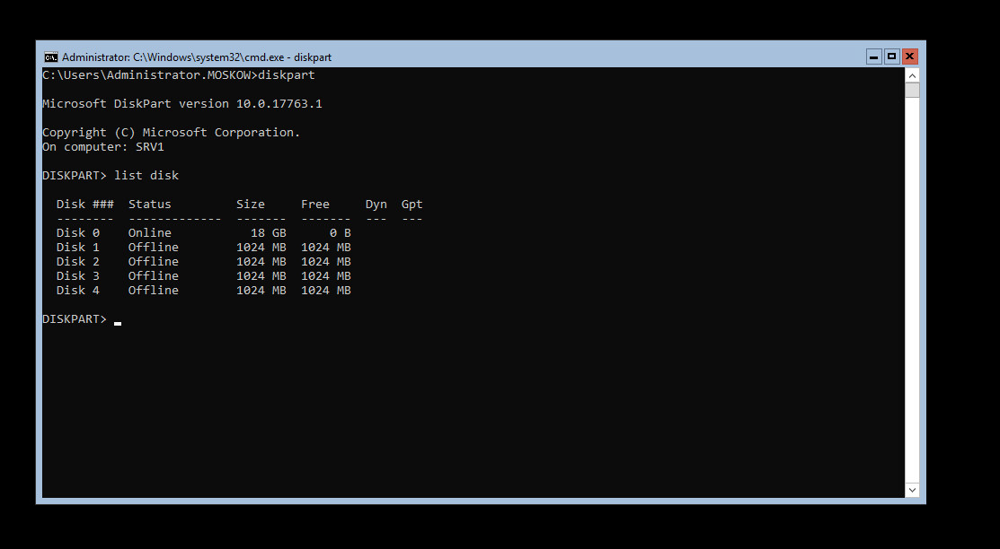  
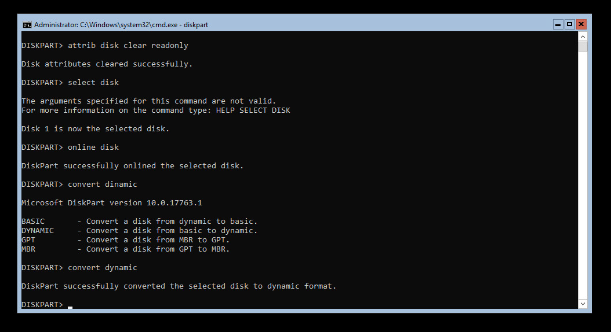 
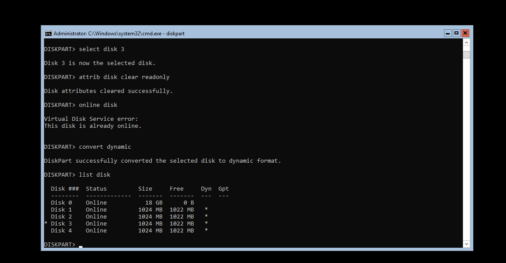 
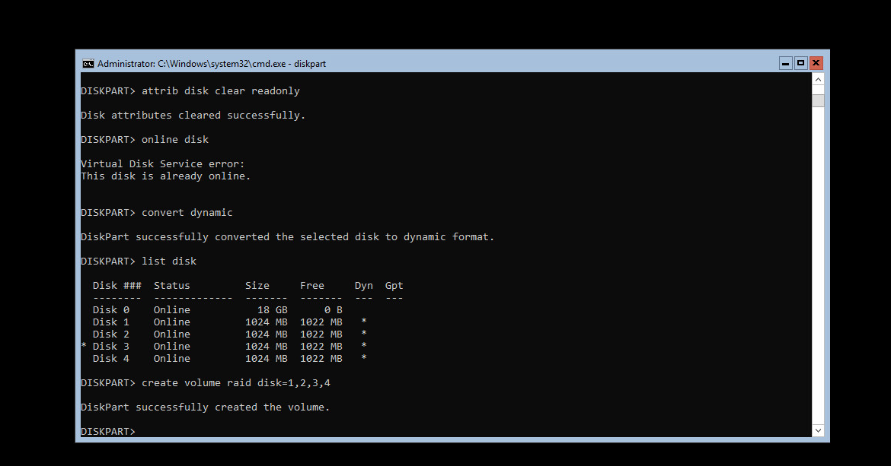  
Далее назначим диску букву D:\ и преобразуем файловую систему в NTFS 
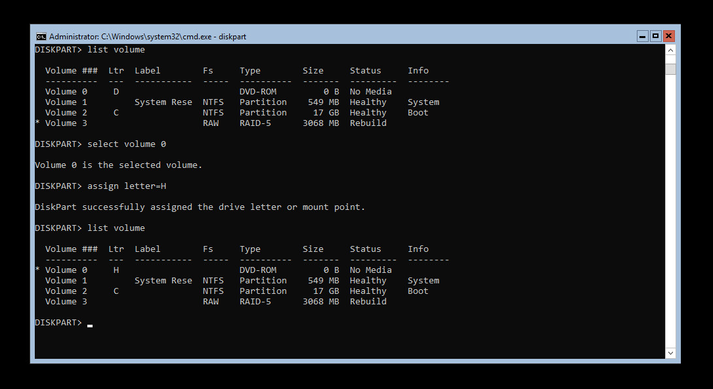
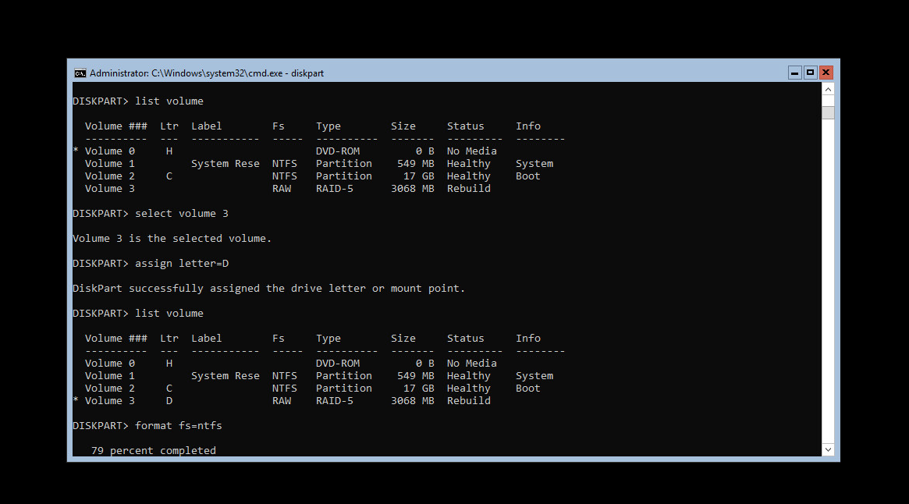  

4. Создадим общие папки для подразделений IT и SALES по адресу *SRV1→d:\shares\departments*.  
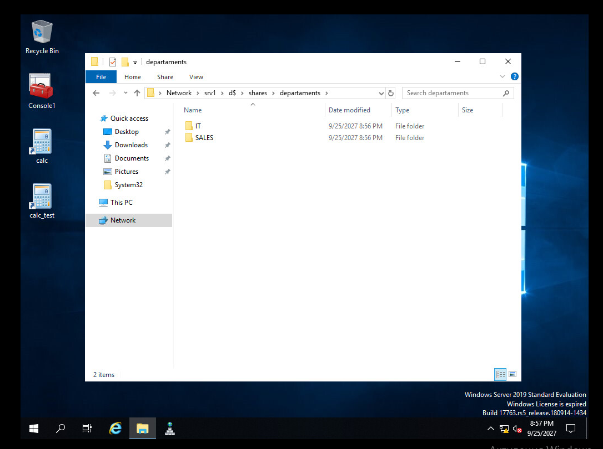  
После в ***Server Manager*** выбираем File and storage services -> Shares -> New shares, далее выбираем папку, которую необходимо расшарить и настраиваем права доступа  
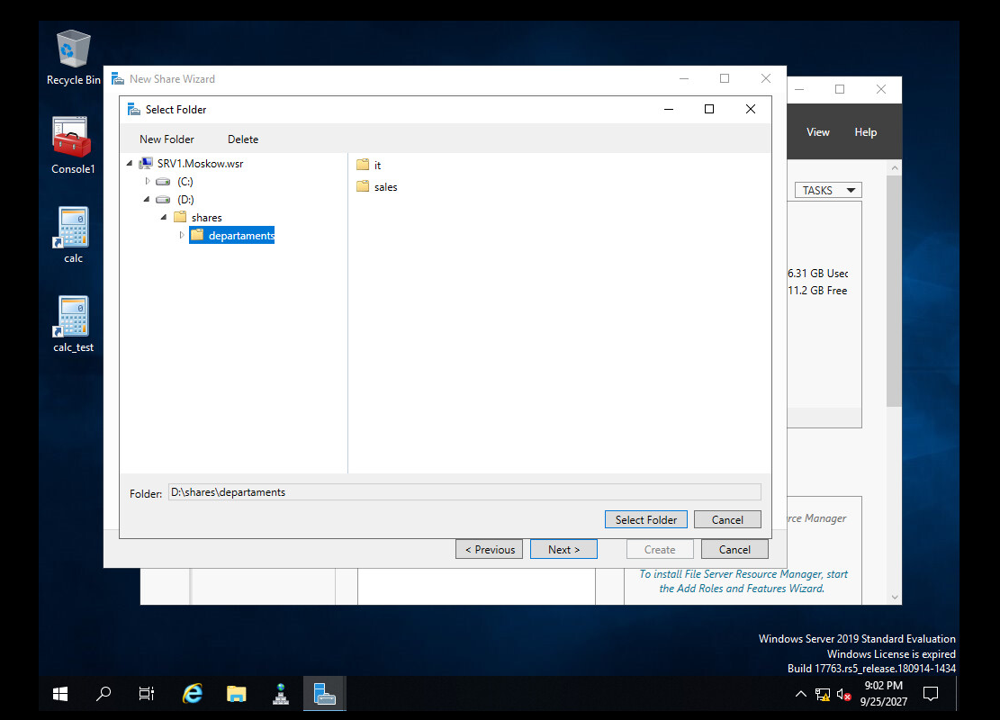   
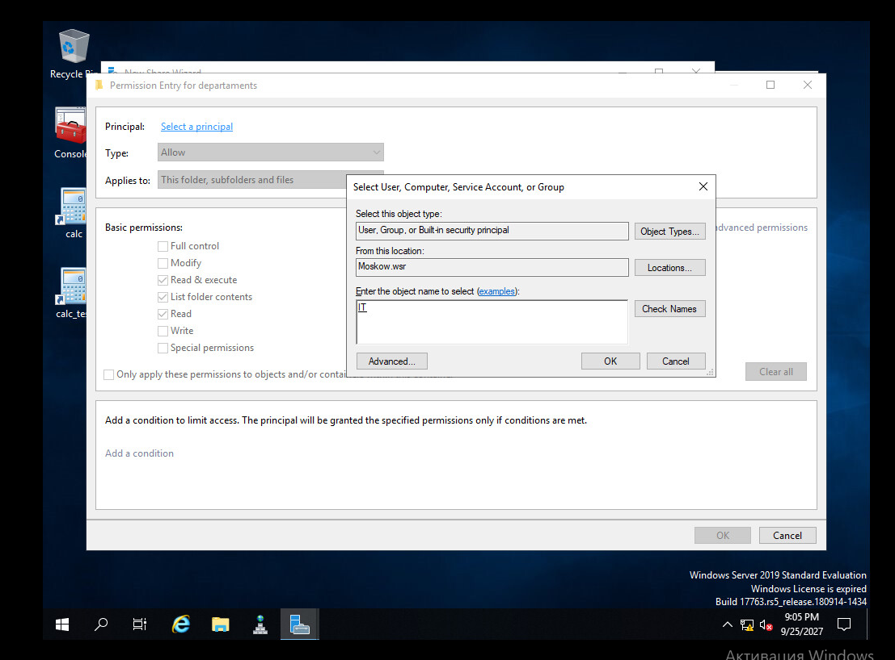
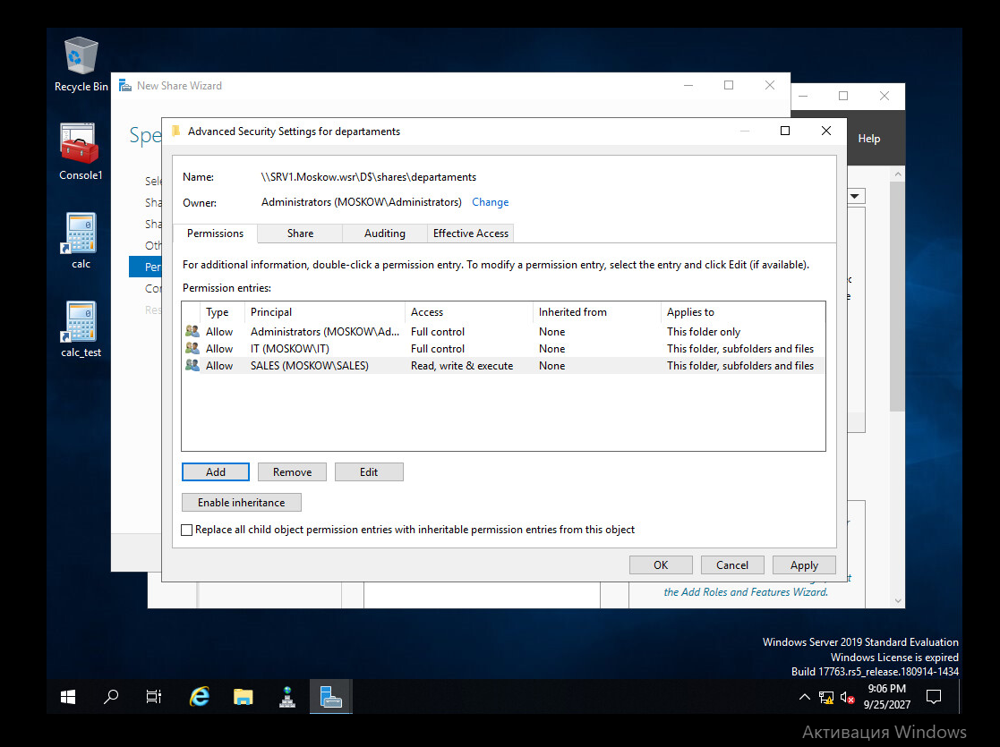

Далее уже в самих папках настраиваем соответствующие права доступа на вкладке **security**  
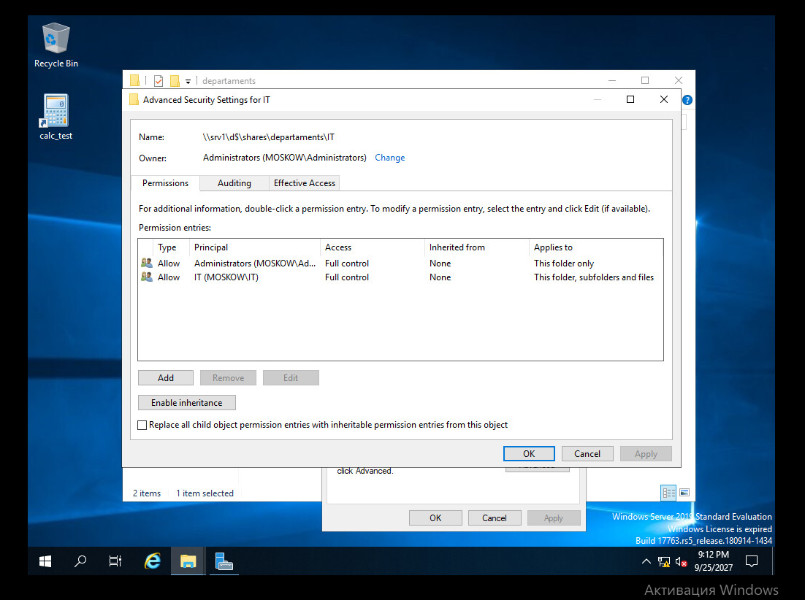
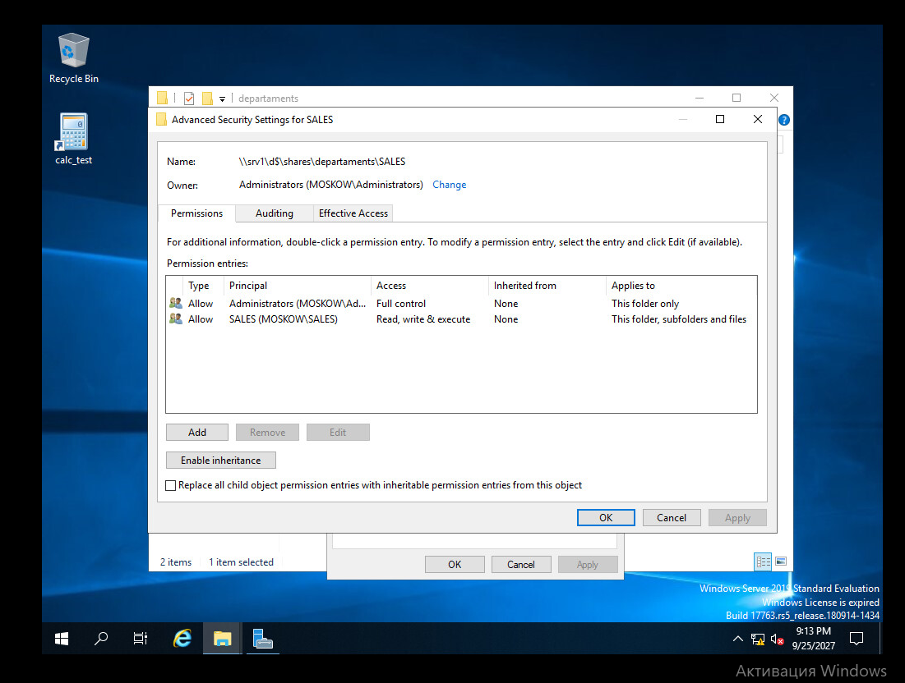 

5. Остальные задания были выполнены в предыдущих работах.
